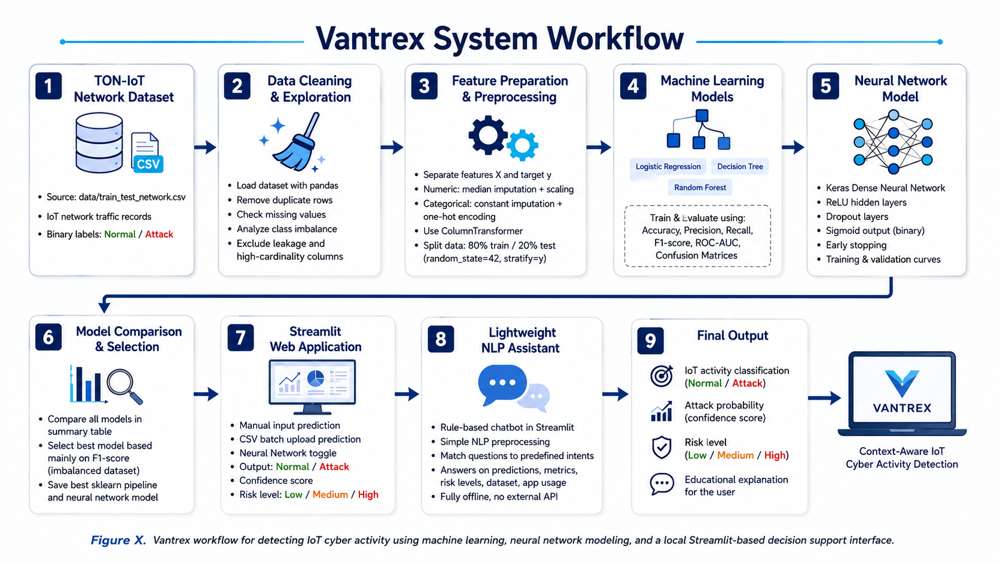
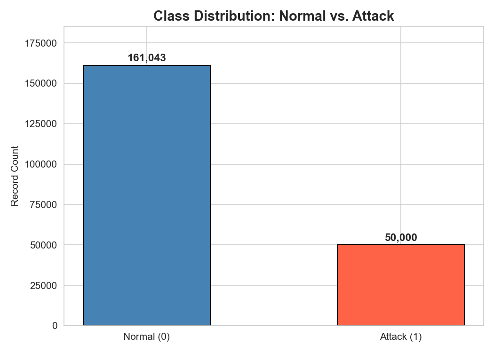
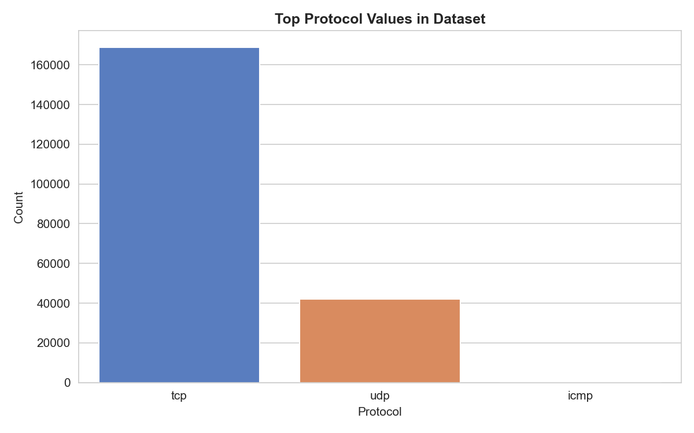
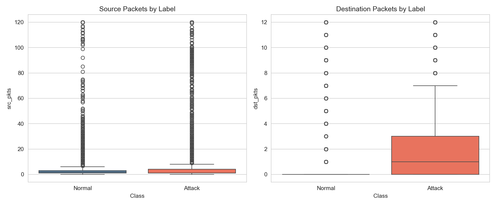
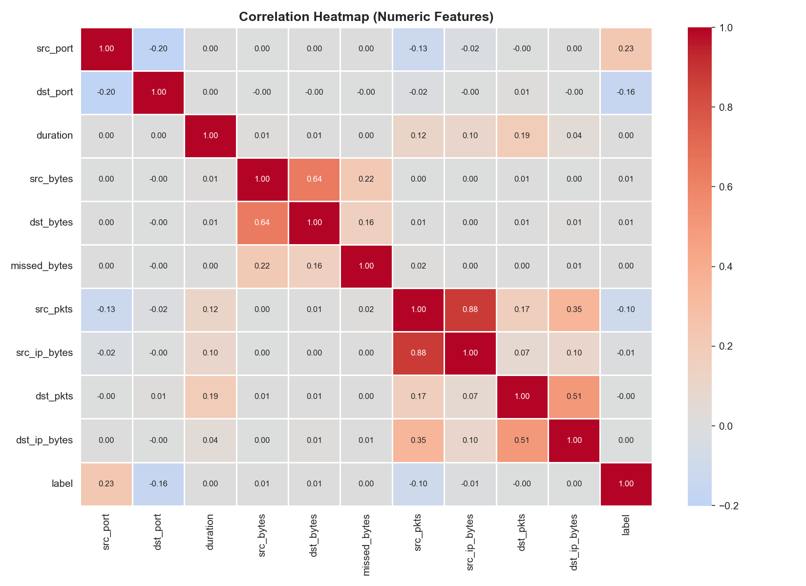
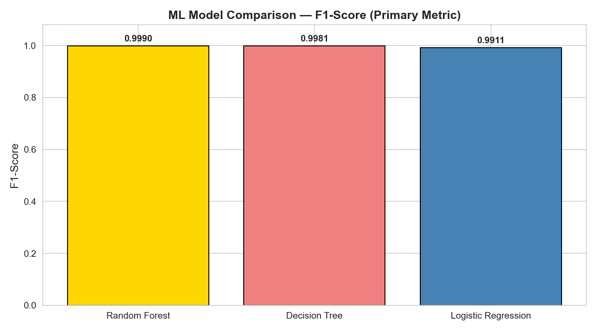
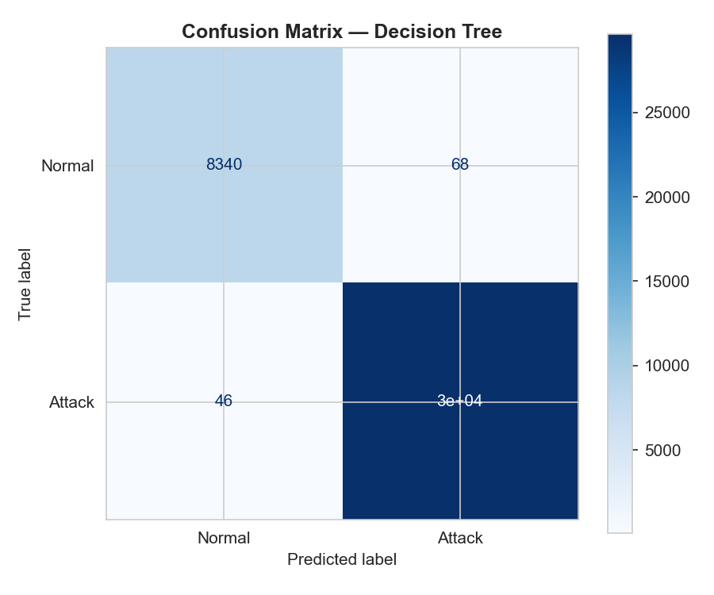
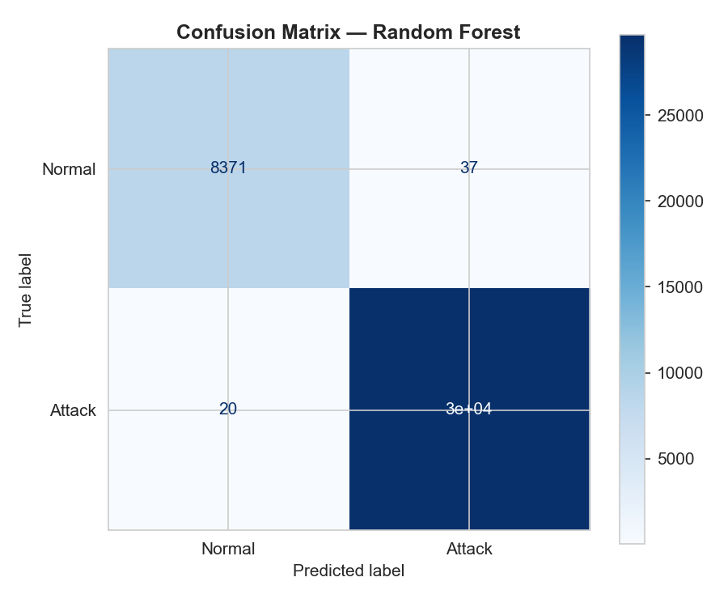
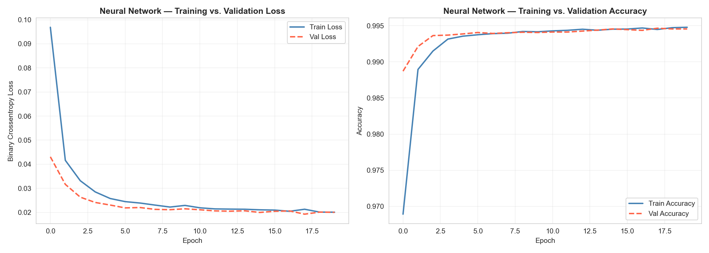

# Vantrex: Context-Aware IoT Cyber Activity Detection

> Binary classification of IoT network traffic — detecting **Normal** vs **Attack** activity using Machine Learning and Deep Learning.


---

## Overview

**Vantrex** is a capstone machine learning system that analyzes IoT network traffic features and classifies each connection as either **Normal** or **Attack**. It is trained on the TON-IoT Network Dataset and delivered as an interactive Streamlit web application supporting single-record and batch predictions, a built-in rule-based AI Assistant, and an optional Keras Neural Network backend.

---

## System Workflow



*End-to-end pipeline: raw TON-IoT data → cleaning → preprocessing → model training → evaluation → Streamlit deployment.*

---

## Project Workflow

```
TON-IoT Dataset (211K rows, 44 columns)
        │
        ▼
Data Quality Checks & Cleaning
  • Drop high-cardinality / irrelevant columns
  • Replace "-" strings with "missing"
  • Handle missing values
        │
        ▼
Exploratory Data Analysis (EDA)
  • Class distribution, protocol breakdown
  • Feature correlations, byte/packet distributions
        │
        ▼
Feature & Target Selection
  • label  →  target  (0 = Normal, 1 = Attack)
  • 34 retained features (numeric + categorical)
        │
        ▼
Train / Test Split  (80 / 20, stratified, random_state=42)
        │
        ▼
Preprocessing Pipeline  (ColumnTransformer)
  • StandardScaler   → numeric features
  • OneHotEncoder    → categorical features
        │
        ├──► Logistic Regression
        ├──► Decision Tree
        ├──► Random Forest          ← Best ML model
        │
        ▼
Keras Dense Neural Network
  • 3 hidden layers + Dropout
  • 10+ epochs, binary cross-entropy loss
        │
        ▼
Model Evaluation & Comparison
  • Accuracy, Precision, Recall, F1-Score, ROC-AUC
  • Confusion matrices for all models
        │
        ▼
Streamlit Web Application
  • Manual prediction · CSV batch · AI Assistant
```

---

## Tech Stack

| Layer | Tools |
|---|---|
| Language | Python 3.10+ |
| ML Models | scikit-learn (Logistic Regression, Decision Tree, Random Forest) |
| Deep Learning | TensorFlow / Keras (Dense NN) |
| Data | pandas, NumPy |
| Visualization | Matplotlib, Seaborn |
| Web App | Streamlit |
| Serialization | joblib (sklearn pipeline), `.keras` (NN) |

---

## Dataset

**TON-IoT Network Dataset** — `data/train_test_network.csv`

| Property | Value |
|---|---|
| Rows | 211,043 |
| Columns | 44 |
| Target column | `label` |
| Classes | 0 = Normal · 1 = Attack |
| Class balance | ~24% Normal · ~76% Attack (imbalanced) |
| Primary metric | **F1-Score** |

> F1-Score is used as the primary metric because the dataset is significantly imbalanced (~76% Attack records). Accuracy alone would be misleading in this setting.

---

## Repository Structure

```
capstone_ASEEL_ALMUTAIRI/
├── notebook.ipynb                       # Main ML pipeline — run this first
├── report.md                            # Written capstone report (6 sections)
├── requirements.txt                     # Python dependencies
├── README.md                            # This file
│
├── data/
│   └── train_test_network.csv           # Raw TON-IoT dataset
│
├── models/                              # Generated by notebook.ipynb
│   ├── best_pipeline.pkl                # sklearn Pipeline (preprocessor + RF)
│   ├── nn_model.keras                   # Keras Dense Neural Network
│   ├── nn_preprocessor.pkl              # ColumnTransformer fitted for NN
│   ├── label_mapping.json               # {0: "Normal", 1: "Attack"}
│   └── feature_config.json              # Numeric and categorical feature lists
│
├── app/
│   └── app.py                           # Streamlit web application
│
├── figures/                             # Auto-generated by notebook.ipynb
│   ├── workflow.png
│   ├── class_distribution.png
│   ├── attack_type_distribution.png
│   ├── duration_src_bytes_distribution.png
│   ├── pkts_by_label.png
│   ├── correlation_heatmap.png
│   ├── proto_distribution.png
│   ├── confusion_matrix_logistic_regression.png
│   ├── confusion_matrix_decision_tree.png
│   ├── confusion_matrix_random_forest.png
│   ├── confusion_matrix_neural_network.png
│   ├── ml_model_comparison.png
│   └── nn_training_curves.png
│
└── results/
    └── model_comparison.csv             # All model metrics
```

---

## How to Run

### 1 — Install dependencies

```bash
pip install -r requirements.txt
```

### 2 — Run the notebook

Open `notebook.ipynb` in Jupyter or VS Code and run all cells **top to bottom**:

```bash
jupyter notebook notebook.ipynb
```

The notebook will:
1. Load and clean the TON-IoT dataset
2. Run exploratory data analysis and save figures to `figures/`
3. Train Logistic Regression, Decision Tree, and Random Forest models
4. Build and train the Keras Dense Neural Network
5. Evaluate and compare all models by F1-Score
6. Save the best pipeline to `models/best_pipeline.pkl`
7. Save the NN to `models/nn_model.keras`
8. Save results to `results/model_comparison.csv`

> **The notebook must complete successfully before launching the app.** The app reads the saved model files from `models/`.

### 3 — Launch the Streamlit app

```bash
streamlit run app/app.py
```

Open `http://localhost:8501` in your browser.

---

## Model Summary

| Model | Type | Library |
|---|---|---|
| Logistic Regression | Linear baseline | scikit-learn |
| Decision Tree | Tree-based | scikit-learn |
| Random Forest | Ensemble (100 estimators) | scikit-learn |
| Keras Dense NN | 3 hidden layers + Dropout, 10+ epochs | TensorFlow / Keras |

Train/test split: **80 / 20**, `random_state=42`, `stratify=y`.

---

## Results

All models were evaluated on the held-out 20% test set. Metrics are sourced directly from `results/model_comparison.csv`.

| Model | Accuracy | Precision | Recall | **F1-Score** | ROC-AUC |
|---|---|---|---|---|---|
| **Random Forest** | 99.85% | 99.87% | 99.93% | **99.90%** | 99.99% |
| Decision Tree | 99.70% | 99.77% | 99.85% | 99.81% | 99.37% |
| Neural Network (Keras) | 99.44% | 99.54% | 99.75% | 99.64% | 99.93% |
| Logistic Regression | 98.61% | 99.43% | 98.79% | 99.11% | 99.51% |

**Random Forest** was selected as the best model and saved as the default pipeline.

---

## Training and Evaluation Visuals

### EDA — Class Distribution



### EDA — Protocol Breakdown



### EDA — Traffic Volume by Label



### EDA — Feature Correlation Heatmap



### ML Model Comparison



### Confusion Matrices

| Logistic Regression | Decision Tree |
|---|---|
|  |  |

| Random Forest | Neural Network |
|---|---|
|  |  |

### Neural Network — Training Curves



---

## Streamlit App — Key Features

The web app (`app/app.py`) loads the saved models at startup and provides three tabs:

| Tab | Feature |
|---|---|
| **Manual Input** | Enter individual IoT traffic feature values (protocol, ports, bytes, packets) and run the classifier on a single record |
| **CSV Batch Upload** | Upload a `.csv` file containing multiple records to classify them all at once and download results |
| **🤖 AI Assistant** | Rule-based NLP chatbot — answers questions about the model, metrics, risk levels, and how to use the app. Fully offline, no external API |

**Per-prediction output:**

- `Prediction` — Normal or Attack
- `Confidence` — Attack probability as a percentage
- `Risk Level` — 🟢 Low (< 50%) · 🟡 Medium (50–80%) · 🛑 High (≥ 80%)

**Sidebar options:**

- Toggle between the sklearn Random Forest pipeline and the Keras Neural Network

---

## Future Work

- Multi-class attack type classification using the `type` column
- Cloud deployment via Streamlit Community Cloud
- Real-time packet capture integration
- SHAP-based model explainability
- Threshold tuning for security operations environments

---

## License

This project is submitted as an academic capstone. Dataset credit: [TON-IoT Network Dataset](https://research.unsw.edu.au/projects/toniot-datasets).

---

*Built with scikit-learn · TensorFlow/Keras · Streamlit · pandas · NumPy · Matplotlib*
